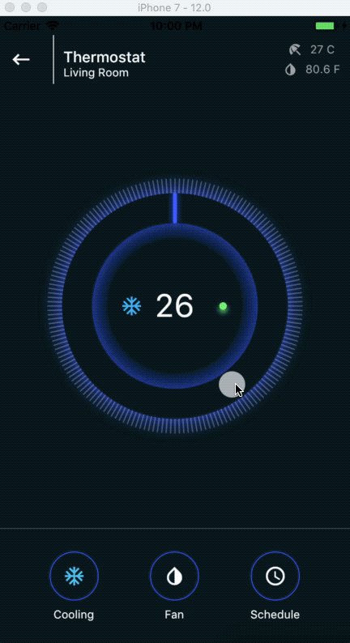

# Thermostat
Widget is a Thermostat that help you to choose temperature from a given range.



# Usage
Let's demo the basic usage
```dart
Thermostat(
      radius: 150.0,
      turnOn: true,
      modeIcon: Icon(
        Icons.ac_unit,
        color: Color(0xFF3CAEF4),
      ),
      textStyle: new TextStyle(
        color: const Color(0xFFFFFFFD),
        fontSize: 34.0,
      ),
      minValue: 18,
      maxValue: 38,
      initialValue: 26,
      onValueChanged: (value) {
        print('Selected value : $value');
      },
)

```


# Known issue
On Android device outer ring shadow flicker when I try to animate it's value on user touch down/up event,
If you don't want to animate outer shadow then just replace
```dart
convertRadiusToSigma(18.0 + (5.0 * glowness)),
```

with
```dart
convertRadiusToSigma(18.0),
```
at line number 279 in "thermostat.dart" it will work fine

For iPhone everything works fine(tested on simulator).